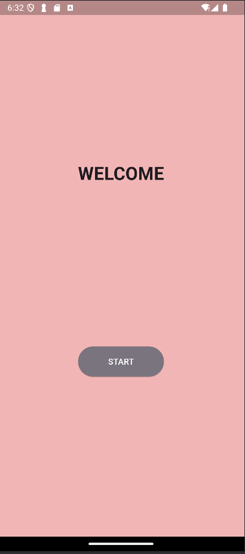
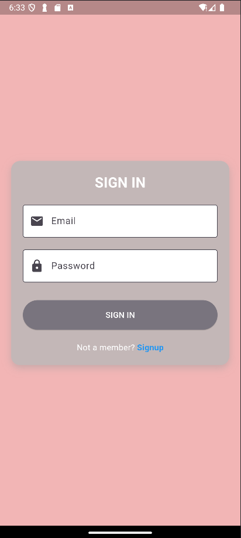
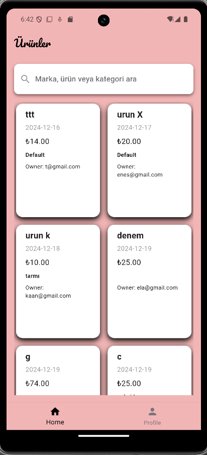
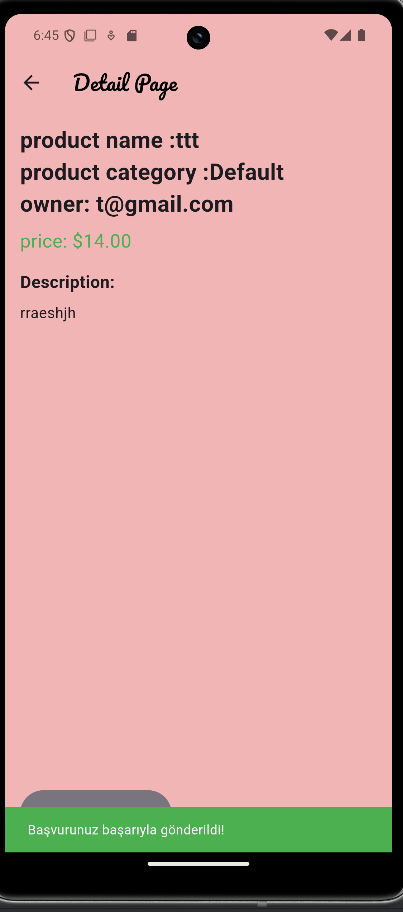
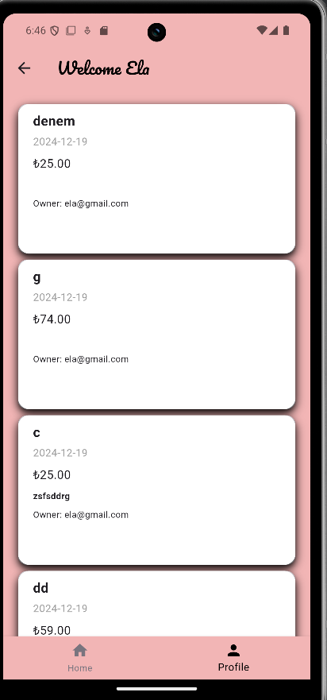
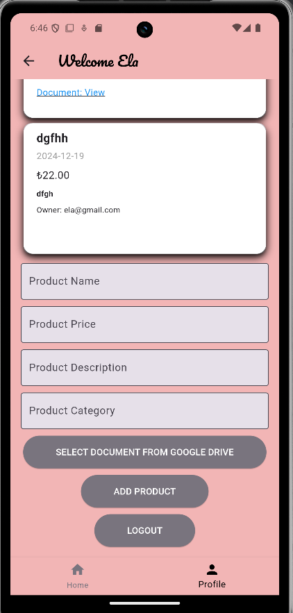
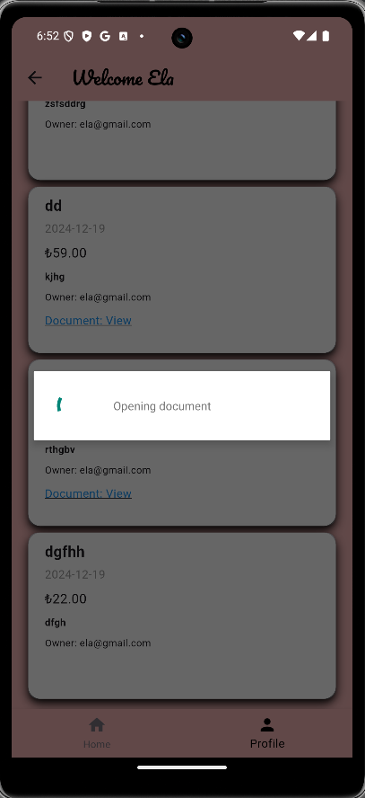
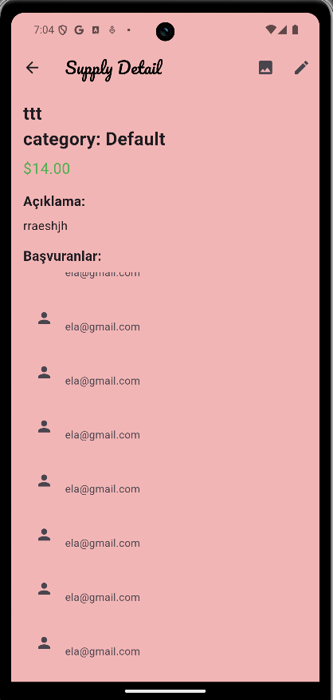
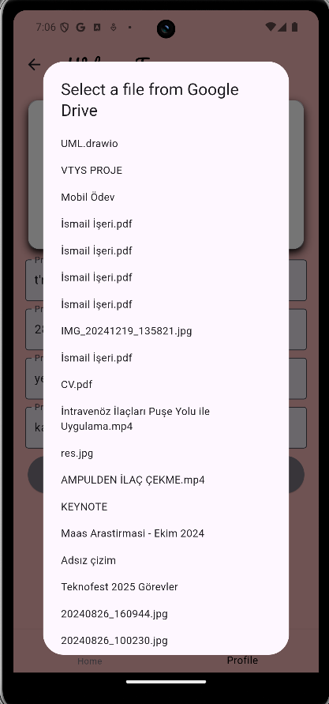
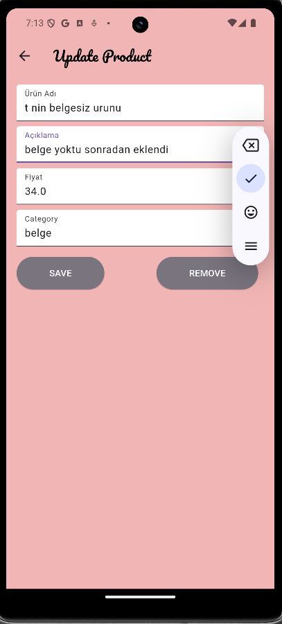

# Endüstriyel Tedarik Uygulaması

## Genel Bakış
Endüstriyel Tedarik Uygulaması, tedarikçiler ve alıcıları endüstri sektöründe bir araya getirmek için tasarlanmış bir mobil uygulamadır. Kullanıcılar, tedarik teklifleri paylaşabilir, paylaşılan tedariklere başvurabilir ve aktivitelerini kullanıcı dostu bir arayüz üzerinden yönetebilir. Uygulama, Flutter ve Firebase ile geliştirilmiştir.

---

## Geliştirici Ekip

 <table>
    <tr>
      <th>İsim</th>
      <th>Görev</th>
      <th>İletişim</th>
    </tr>
    <tr>
      <td>Enes Kaan Afacan</td>
      <td>Developer</td>
      <td>
        <a href="https://github.com/eneskaanafacan" target="_blank"></a>
        <a href="https://www.linkedin.com/in/enes-kaan-afacan-a60b32259/" target="_blank" ></a>
      </td>
    </tr>
    <tr>
      <td>Elanur İmirgi</td>
      <td>Developer</td>
      <td>
        <a href="https://github.com/elanurimirgi" target="_blank"></a>
        <a href="https://www.linkedin.com/in/elanur-imirgi/" target="_blank" ></a>
      </td>
    </tr>
    <tr>
      <td>Ezgi Şaşı</td>
      <td>Developer</td>
      <td>
        <a href="https://github.com/ezgisasi" target="_blank"></a>
        <a href="https://www.linkedin.com/in/ezgi-%C5%9Fa%C5%9F%C4%B1-aa66212b2/" target="_blank"></a>
      </td>
    </tr>
  </tr>
  </table>

---

## Uygulama Görselleri
<p align="center">











</p>

---


## Özellikler

1. **Kullanıcı Doğrulama**
   - Giriş ve Kayıt olma işlemleri.
   

2. **Tedarik Yönetimi**
   - Tedariklerin açıklama, ilgili sektörler ve isteğe bağlı dosya ekleri ile paylaşılması.
   - Paylaşılan tedariklerin görüntülenmesi ve güncellenmesi.
   - Paylaşılan tedariklere yapılan başvuruları ve başvuran profillerini görüntüleme.

3. **Arama ve Bildirimler**
   - Kelime bazlı tedarik arama.
   - Paylaşılan tedariklere başvuru yapıldığında bildirim alma.

4. **Kullanıcı Profili**
   - Kullanıcı profillerinin yönetimi (isteğe bağlı).

---


## Veritabanı

- Gerçek zamanlı veritabanı ve bildirimler için Firebase kullanıldı.

---


## Kurulum ve Yükleme

1. Depoyu klonlayın:
   ```bash
   git clone https://github.com/elanurimirgi/IndustrialApp.git
   ```

2. Proje dizinine gidin:
   ```bash
   cd IndustrialApp
   ```

3. Bağımlılıkları yükleyin:
   ```bash
   flutter pub get
   ```

4. Firebase konfigürasyonunuzu ekleyin:
   - Firebase API anahtarlarını `.env` dosyasına yerleştirin.

5. Uygulamayı çalıştırın:
   ```bash
   flutter run
   ```

---

## Test

- Kod kalitesini sağlamak için Unit ve Widget testleri uygulanmıştır.
- Testleri çalıştırmak için:
  ```bash
  flutter test
  ```

---


## Lisans

Bu proje MIT Lisansı altında lisanslanmıştır. Detaylar için LICENSE dosyasına bakınız.

---
